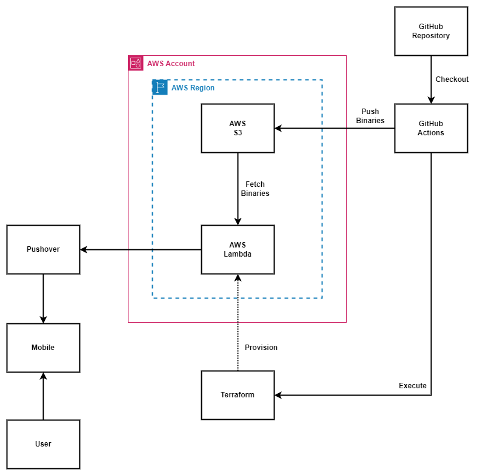

# AWS Cost Tracker

This project is a serverless function (AWS Lambda) provisioned using Terraform to calculate AWS usage cost and forecast for the current month and notify users via Pushover on a daily schedule.

