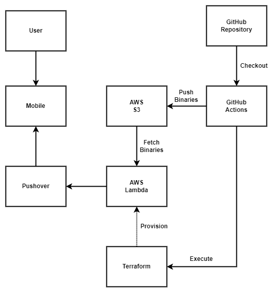

# AWS Cost Tracker

This project is a serverless function (AWS Lambda) provisioned using Terraform to calculate AWS usage cost and forecast for the current month and notify users via Pushover on a daily schedule.

## Cost Incurred

This project uses two AWS C# SDK functions (*GetCostAndUsageAsync* and *GetCostForecastAsync*) which uses AWS Cost Exporer API to query current month's AWS usage and bill forecast. The Cost Explorer API allows you to programmatically query your cost and usage data. You can query for aggregated data such as total monthly costs or total daily usage. You can also query for granular data, such as the number of daily write operations for DynamoDB database tables in your production environment. The AWS Cost Explorer API lets you directly access the interactive, ad-hoc query engine that powers AWS Cost Explorer. Each request will incur a cost of **$0.01 USD**. Hence, if this function is set to trigger once daily, it would cost you **$0.01 x 2 x 30 = $0.60 USD** per month.

## References

- https://docs.aws.amazon.com/cost-management/latest/userguide/ce-api.html
- https://aws.amazon.com/aws-cost-management/aws-cost-explorer/pricing